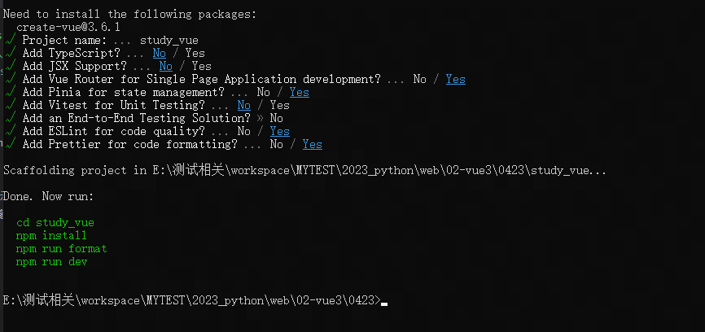

# vue3快速入门
## vue3简介
- vue3简介
  - vue是一套用于构建用户界面的渐进式JS框架
  - vue=vue.js，它和Angular.js、React.js一起，并称为前端三大主流框架
  - 2020年9月18日，vue.js发布3.0版本，代号：one piece （海贼王）
- 名词解释
  - 选项式与组合式
    - vue3的组件有两种不同的书写风格：选项式API和组合式API
    - vue2组件仅有一种书写风格：选项式API
  - Vue脚手架
    - Vue官方提供了：create-vue来构建项目（上一代是vue-cli）
    - 
    ```
    npm init vue@latest     #构建最新版vue3项
    npm init vue@3          #构建vue3项目
    npm init vue@2          #构建vue2项目
    # 要求有node.js的环境（node16以上）
    ```
  - Node.js
    - 是一个基于Chrome V8引擎的JavaScript运行时，即它是一个JavaScript除浏览器外的另一个运行环境（平台）。Node.js不是变成语言、不是库、不是框架。Vue.js是JS框架。
    - 和浏览器一样，支持大部分ES6语法，但目前还不支持export、import等模块语法
  - Npm与Yarn、Pnpm
    - 都是Node.js包管理工具，从Node.js16.10版开始，自带安装npm和yarn，主要用来安装/卸载Node.js的模块。类似于python的pip、Java的
    - npm和yarn最好不要同时用，坚持使用其中一个即可
    - npm 命令
      - npm install 命令
        - 分全局和局部，局部的意思就是我们装的包都是装在我们的项目下面
        - 下载到你配置的全局目录下
        ```
        npm install xxx --global     #--global的缩写：-g
        ```
        - 下载到项目当前的目录下
        ```
        # 存package.json的生产依赖
        npm install xxx
        npm install xxx --save   #--save的缩写： -S
        # 存package.json的开发依赖
        npm install xxx --save-dev  #--save-dev的缩写： -D
        # install的别名：i
        # uninstall的别名：rm、r、remove
        
        npm config get prefix  #获取当前全局路径
        npm list -g   #查看是否安装
        npm --version  #查看版本
        npm uninstall xxxx -g  #卸载
        # 项目（生产）依赖：dependencies
        在运行这个项目的业务逻辑时候需要依赖的，跟业务有关的
        # 开发依赖：devDependencies 
        开发依赖还包括 webpack、webpack-cli、rollup 等构建工具，less cass等预处理器、测试工具等等，只在开发的时候使用 、在项目运行的时候不需要。
        开发依赖的目的是为了减少插件在安装依赖时node_modules的所占的内存，提升安装依赖的速度，节省线上及其的硬盘资源以及部署上线的时间。

        ```
        - 90%的包都是装在项目下（项目要用到的），装在全局下的包可能是 打包工具、代码检测规则等
  - vue-cli和create-vue
    -  它们都是Vue的脚手架工具，vue-cli是第一代，create-vue是第二代
    -  vue-cli:用于创建vue.js+ Webpack（打包）的项目模板  #npm run serve
    -  create-vue:用于创建vue.js+ Vite（打包）的项目模板 #npm run dev
  - webpack、rollup和vite
    - 它们都可以把项目中JS、Scss、TS等代码，打包为合适的格式供浏览器使用
    - webpack:纯打包工具
    - rollup：纯打包工具，打的包非常精简、体积小、效率高
    - vite：新型前端构建工具，底层基于rollup
  - Element UI与Element Plus
    - Element是基于VUE2.0的桌面端UI框架，手机端有对应框架Mint UI.整个UI风格简约，很实用，同时也极大的提高了开发者的效率，是一个非常受欢迎的组件库。
    - Element Plus，一套为开发者、设计师和产品经理准备的，基于Vue3.0的桌面端组件库。
  - vue-router
    - Vue用来写路由的一个插件。它包含router-link、router-view等组件
  - Vuex与Pinia
    - 它们都是Vue的全局状态管理器
    - Vuex：之前流行的状态管理器
    - Pinia：它比Vuex简洁许多，也是Vue3目前所推荐的。
  - axios
    - axios是一个基于ES6的promise的网络请求库，说白了就是一个封装好的XMLHttpRequests，类似于ajax库（用于和服务器进行HTTP(S)通讯，所有主流浏览器都支持
## 第一个vue3项目
- 创建一个vue3项目，项目的目录结构
  - 创建vue项目命令：（采用create-vue工具）
    ```
    npm create vue@3  #或者
    npm init vue@3
    ```
    - 注意1：nodejs版本最低要求为16+
    - 注意2：首次运行，会提示你安装create-vue包
    - 注意3：以上两个命令，没有啥区别

    - 启动我们项目的命令：npm run dev
  - vue项目下的目录结构：
    - node_modules：我们项目中需要用到的依赖的包
    - public是公共的目录，我们第一次创建的时候会有个vue自带的图标icon
    - src是源代码目录，我们最常用的目录
    - .eslintrc.cjs 是我们用到的eslint插件的配置文件，里面是配置的一些代码检测规则
    - .gitignore 是git相关的文件，上传git的时候忽略的一些文件
    - .prettierrc.json 代码格式化的文件 
    -  index.html 这个是我们项目里唯一的html文件，并且这个文件不可以被省略
    -  vite.config.js
       -  alias：别名，@符号=我们src的目录，我们后面开发项目的时候，我们看到@符号，就代表是我们src的目录；这个是vite默认给我们配置的这个别名的
 - 格式化与代码检测
   - prettier会在我们保存文件的时候，帮我们把格式化我们的代码，改成统一的风格

## 开发工具及插件安装
- VScode安装、格式化，插件，

## 第一个vue3项目代码分析
- vue3项目的文件介绍


