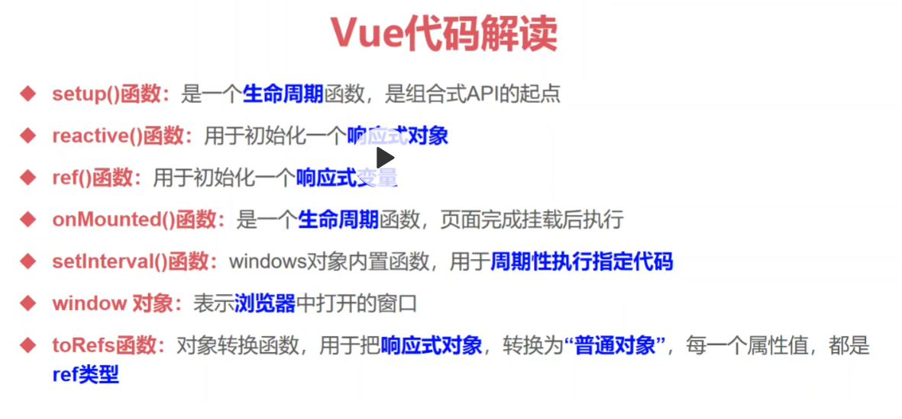
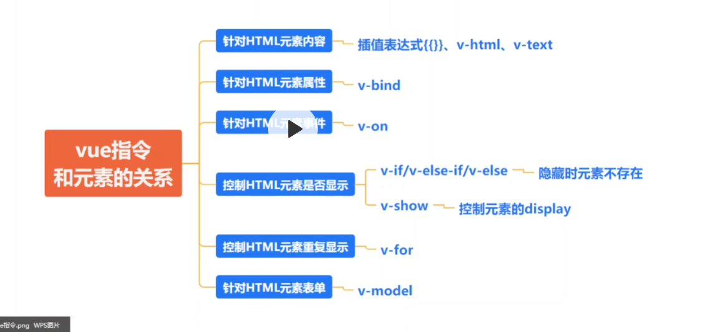
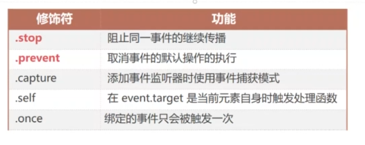
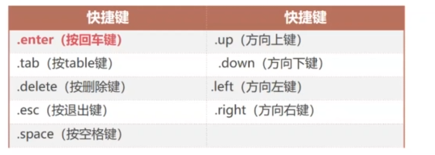

# vue基本指令
## Demo
-DemoTest1:vue基础模板组件相关
-DemoTest2:插值表达式
-DemoTest3:v-text指令 和 v-html指令
-DemoTest4:v-bind指令
-DemoTest5:v-if 和 v-show
-DemoTest6:循环遍历指令v-for
-DemoTest7:事件绑定v-on
-DemoTest7-2:v-on 事件对象，事件属性，event  和 按键修饰符
-DemoTest7-3:v-on 事件修饰符 
-DemoTest8-1:v-model
-DemoTest9:计算属性：computed()函数 
-DemoTest10-1:watch : 侦听对象
-DemoTest10-2:watch : 侦听数组
-DemoTest10-3:watch : 侦听变量
-DemoTest10-4:watch : 侦听对象的某一个属性
-DemoTest11: watchEffect 

## 1.编写第一个vue组件
- 目的是：以一个简单的小案例，来介绍一下vue的组件。vue开发=组件开发

## 2.HTML知识回顾
- 通过回顾html的知识，来介绍vue3的指令用处。

## 3.vue3基本指令。10个左右


## 4.vue指令和元素的关系

- 插值表达式
```
Vue插值表达式的语法为：{{变量/表达式}}
<p>{{message}} </p>   <!--变量-->
<p>{{1+2}} </p>   <!--算术表达式-->
<p>{{10===10}} </p>   <!--关系表达式（全等于）-->
<p>{{1>2?"是":"否"}} </p>   <!--三目运算符-->
```    
### v-on指令
用于绑定事件，三种事件类型、事件对象、事件修饰符、按键修饰符
- 事件与事件对象
  - 事件：用户在处理某件事务上所执行的操作
  - 
  - 事件对象： event对象 就是事件的状态，当某个事件被触发的时候，就会自动产生一个用来描述事件所有的相关信息的事件对象
  - 用于监听DOM事件，如：执行JS代码、执行事件处理方法、执行内联JS方法
  - DOM 事件是指发生在 HTML 或 XML 元素上的一些特定事件,例如鼠标点击、键盘输入、文本选择等。可以使用 JavaScript 监听这些事件并执行相应的操作。
  - 缩写是：@
  - 语法：其中xxevent为事件属性
  ```
  <input v-on:input='js代码/函数'>确定</input>
  ```
  - 事件修饰符
    事件修饰符可以用来修饰任意类型的事件，vue提供了以下几种
    
    
    - 事件的冒泡：
              当我们点击最里层时候会触发所有三层的click事件
              从最具体的元素到不具体的元素（由内到外）
                当子元素（事件源）事件触发，事件会沿着包含关系，依次往上级传递，每一级都可以感知到事件，直到触发根元素（根源)
            事件冒泡就是指父元素和子元素有相同的事件,当触发子元素事件时,会向上冒泡,同时也会触发父元素事件
         --> 
  - 按键修饰符:
      vue允许为v-on在监听 键盘操作时添加 按键修饰符。vue为最常用的键提供了别名。例：@keyup.enter
          

  
#### v-bind 和 v-on 和v=model
- v-bind：用于绑定元素的属性的，其实它也可以绑定value属性的，它是单向的（js-->模板)，页面上的改变不会传到绑定的值
- v-on：用来绑定元素的事件的，涉及到事件对象，事件对象也是单向的(模板-->js)
  - 将v-bind和v-on配合起来使用，就能实现表单的双向绑定
- v-model（双向绑定，语法糖--》底层指令就是将v-bind和v-on两者配合使用）是用于绑定元素表单的-value属性，但是因为它只用于绑定value这一个属性，所以value可以省略不写

### v-model指令
用来绑定表单。
### 计算属性computed
一个计算属性，就是一个响应式变量。主要用来处理复杂的计算的
### 侦听属性watch
计算属性能做的事情，侦听器都能够做，更强大
### wartchEffect
侦听属性的增强版。


