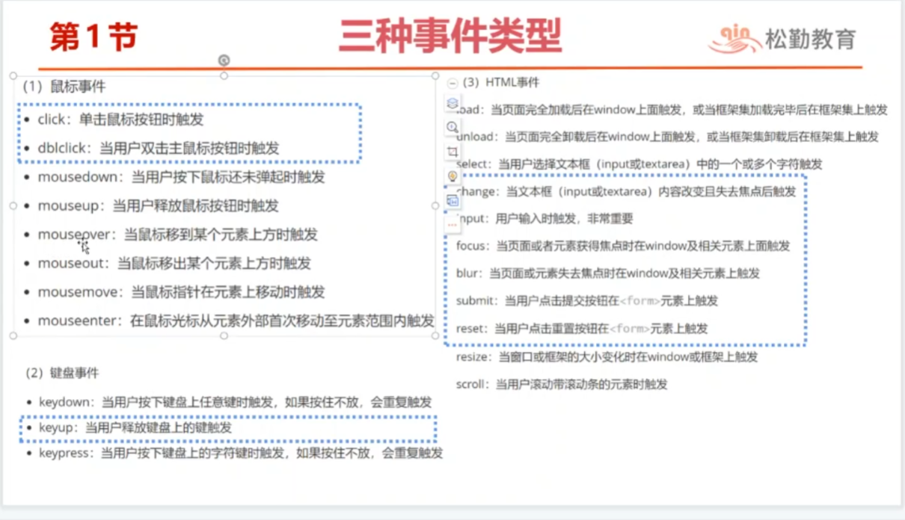

# vue基本指令
## Demo
-DemoTest1:vue基础模板组件相关
-DemoTest2:插值表达式
-DemoTest3:v-text指令 和 v-html指令
-DemoTest4:v-bind指令
-DemoTest5:v-if 和 v-show
-DemoTest6:循环遍历指令v-for
## 1.编写第一个vue组件
- 目的是：以一个简单的小案例，来介绍一下vue的组件。vue开发=组件开发

## 2.HTML知识回顾
- 通过回顾html的知识，来介绍vue3的指令用处。

## 3.vue3基本指令。10个左右


## 4.vue指令和元素的关系

- 插值表达式
```
Vue插值表达式的语法为：{{变量/表达式}}
<p>{{message}} </p>   <!--变量-->
<p>{{1+2}} </p>   <!--算术表达式-->
<p>{{10===10}} </p>   <!--关系表达式（全等于）-->
<p>{{1>2?"是":"否"}} </p>   <!--三目运算符-->
```    
### v-on指令
用于绑定事件，三种事件类型、事件对象、事件修饰符、按键修饰符
- 事件与事件对象
  - 事件：用户在处理某件事务上所执行的操作
  - 事件对象： event对象 就是事件的状态，当某个事件被触发的时候，就会自动产生一个用来描述事件所有的相关信息的事件对象
  - 用于监听DOM事件，如：执行JS代码、执行事件处理方法、执行内联JS方法
  - DOM 事件是指发生在 HTML 或 XML 元素上的一些特定事件,例如鼠标点击、键盘输入、文本选择等。可以使用 JavaScript 监听这些事件并执行相应的操作。
  - 缩写是：@
  - 语法：其中xxevent为事件属性
  ```
  <input v-on:input='js代码/函数'>确定</input>
  ```

### v-model指令
用来绑定表单。
### 计算属性computed
一个计算属性，就是一个响应式变量。主要用来处理复杂的计算的
### 侦听属性watch
计算属性能做的事情，侦听器都能够做，更强大
### wartchEffect
侦听属性的增强版。


